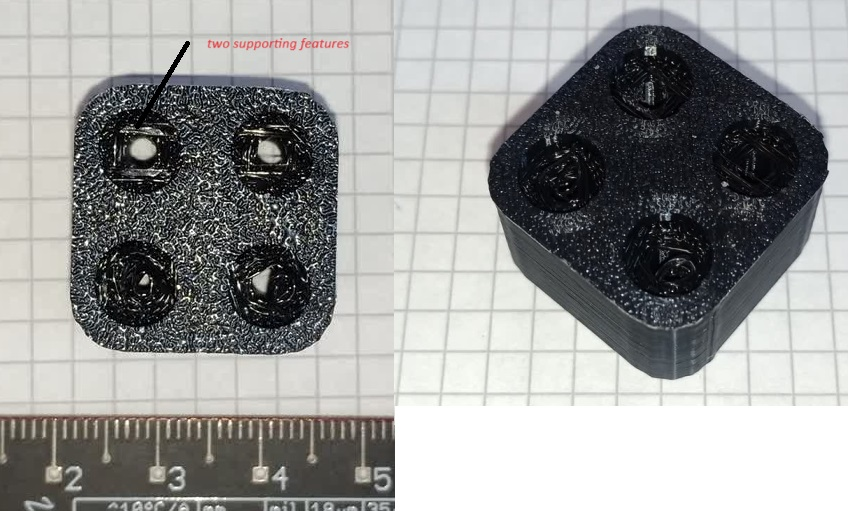

# OpenScad-Suspended-Hole
Allow 3D printing of a small hole stacked on top of a big hole by adding to joining features that support the small hole

Two features inside the suspended_hole library to be able to 3D print a hole, with a bigger nut hole below it, meant to neatly accomodate a nut.

Use:
- include <suspended_hole.scad>
- suspended_hole( 30, 5, 10, 20, 1 ); will instance a 30x5 cylinder with a 10x20 cylinder stacked. use difference to turn it into an hole into your mode.
- suspended_hole_hex is the same, but instance a hexagonal hole meant for hex nuts and bolts
- test_bench() shows a test block with support features enabled/disabled
- stl and gcode for the test block to test on your 3D printer

Below image of the printed test block:

